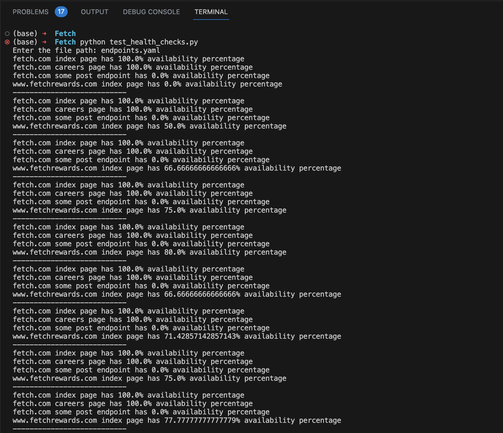
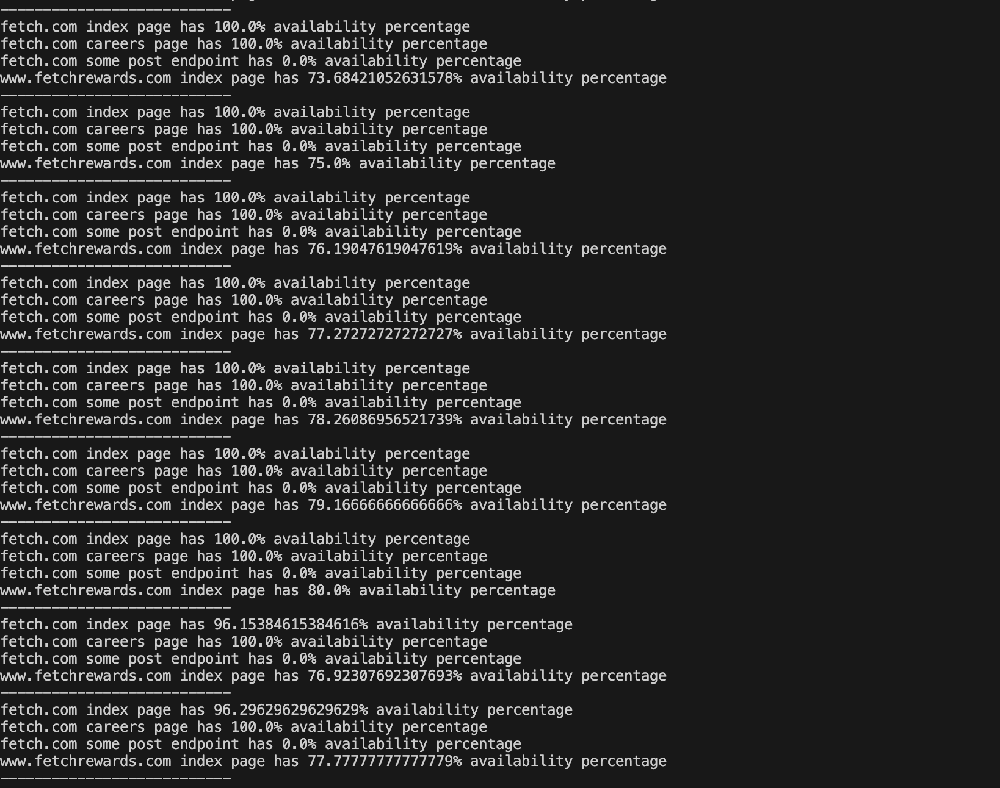

# Fetch Take-Home Exercise — Site Reliability Engineering

- I have completed this assignment in Python.
- To execute the code install python.
- To install python you can use Homebrew.
  
```
$  brew install python
```

## Files in the Repository

1. `endpoints.yaml` - This file consists of all the endpoints that we are hitting.
2. `test_health_checks.py` - The main code
3. `Readme.md` - The readme file for this repository.
4. `Output1.png`, `Output2.png` - These are sample out images of the program.

## Explanation of the code

- The `check_health` function takes the list of endpoints as input and continuously tests the endpoints every 15 seconds.
  
- The `availability` dictionary is used to store the availability data for each endpoint. It keeps track of the total tests conducted and the number of successful tests for each endpoint.
  
- The program iterates over each endpoint and retrieves the necessary information such as the URL, name, headers, and body.
  
- Inside the loop, the program initializes the availability data for each endpoint using `setdefault` to ensure that the keys are present in the dictionary.
  
- It makes an HTTP request to the endpoint using the `requests` library and measures the start and end time to calculate the response latency.
  
- If the response code is within the 2xx range and the response latency is less than 500 milliseconds, the program considers the test as successful and increments the success count for the endpoint.
  
- Exceptions such as connection errors are handled using a `try-except` block, and any exceptions are ignored.
  
- The program increments the total test count for the endpoint.
  
- The availability percentage is calculated by dividing the success count by the total test count and multiplying by 100.
  
- Finally, the availability percentage is printed for each endpoint in the desired format.
  
- After printing the availability for all endpoints, the program waits for 15 seconds using `time.sleep(15)` before repeating the process.

## To Run the CODE

- Clone the repository.
- Open VScode.
- In the terminal.
- RUN

```
   $ python test_health_checks.py
```

- It will prompt "Enter the file path: "
- Kindly enter `endpoints.yaml` in the prompt.

```
Enter the file path: endpoints.yaml
```

- To stop the program press `cntrl-c`.

## Output



